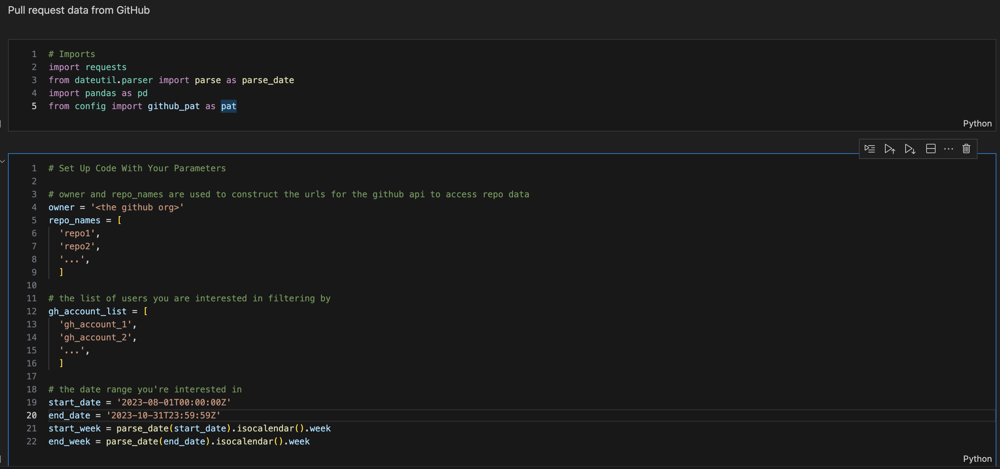

# Reporting tools

This is a repo with custom written python notebooks to extract useful PR data and Jira data to analyze team health and operations.

## Setup

### Environment Requirements

- Python ^v.3.11

Install the latest version of Python 3 from python's website. Make sure you add python3 and pip3 (python's package manager) to your PATH.

*Note to Mac Users: Python 2 comes installed natively on macs. You may run into some complications selecting python versions throughout the install. Pay attention to versioning as you go.*

### Recommended extensions (VSCode)

- Python (includes)
  - Pylance
- Jupyter (includes)
  - Jupyter Cell Tags
  - Jupyter Keymap
  - Jupyter Notebook Renderers
  - Jupyter Slide Show

### Getting the required python deps

From the repo's root directory, run the following command in your terminal:

```bash
bash install_dependencies.sh
```

Alternatively, you can manually add the following python packages via pip3:

- requests
- jupyter
- pandas
- dateutil

### Adding Secrets

The repo assumes you've included a config.py file in the `src` directory. Here is where you add all of your personal access tokens or secrets required to get upstream data. For your convenience, there is a `config_template.py` file containing all the fields required for all the notebooks included here. Add your secrets to the template and remove the `_template` from the filename.

## Running the notebook

Open the any file ending in `.ipynb` in your editor. If you've downloaded the proper extensions, this should render similarly to the window below:



If this is your first time running, you may need to set your kernal. Click on the kernal environment in the top right corner of the notebook and select your latest version of python 3.

From here, running the code is simple. You can run the entire notebook at once by clicking the "run all" button at the top, or you can select and run each cell individually with the UI or by focusing on the cell and clicking `cmd + enter`.

### Adding your data

Each notebook should have a cell near the top titled `# Set Up Code With Your Parameters`. Add any necessary data here specific to your use case.

### Jupyter notebooks

For those of you unfamiliar with Jupyter Notebooks, they are a convenient way to work in python for non-application code. They allow for small blocks of code, markdown, etc. to be intermingled in a single view, and runs all code in a python kernal with a shared workspace. Variable and function declarations are preserved in the workspace as each cell declaring them is run, making for a convenient way to incrementally perform script like operations. Python Notebooks are often the preferred working environment for (data) scientists and analysts for their convenient way to manage code and display outputs.
